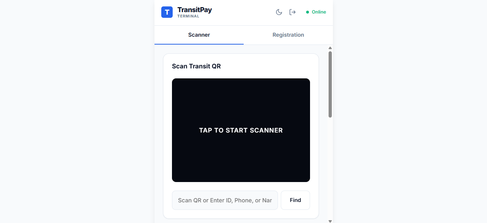
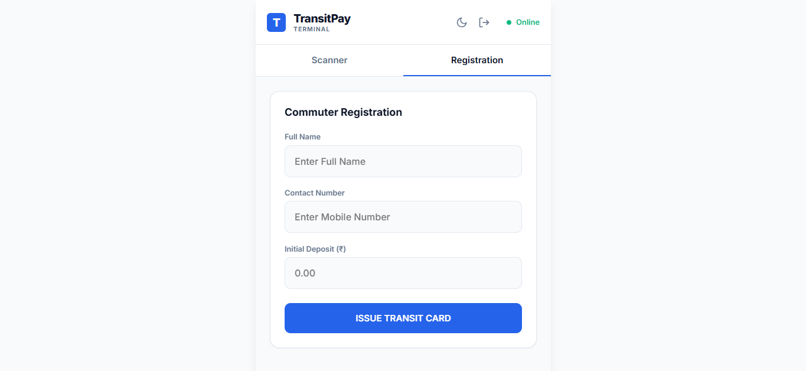
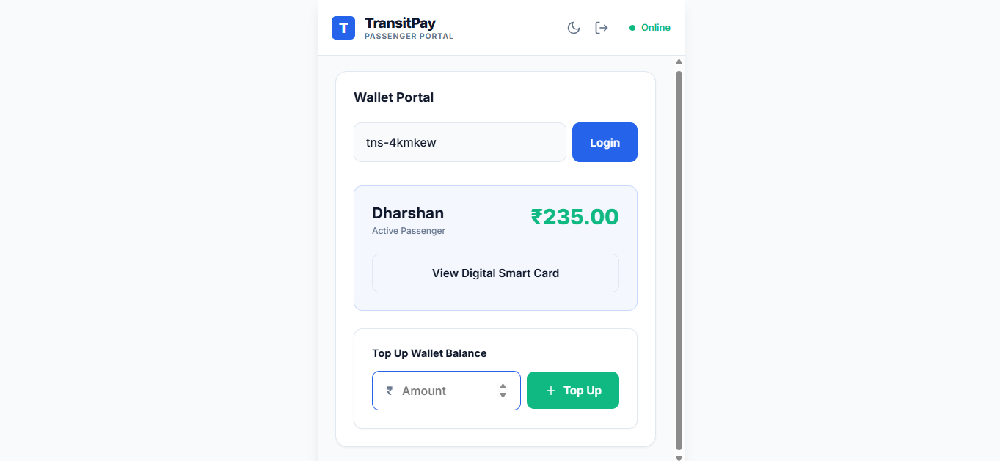
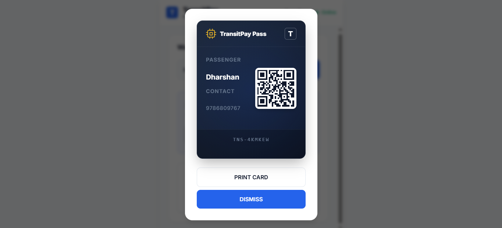

# 🚌 TransitPay Ecosystem

<div align="center">
  
</div>

## 🔗 Live Demo

[Click here to test the PWA](https://dharshansundarraj.github.io/TransitPay-Engine/frontend/)

_(Note: This demo showcases the UI, Offline Scanner Engine, and Dynamic Caching. The Spring Boot backend is not hosted on GitHub Pages)._

An enterprise-grade, closed-loop digital wallet and ticketing engine built for local transit networks.

**TransitPay** bridges the gap between physical hardware and secure financial software. It eliminates the logistical nightmare of cash handling, exact change, and paper ticketing on fast-moving bus routes by replacing them with a high-speed, QR-based digital ledger.

## The Problem it Solves

Local transit conductors face immense friction handling cash and paper tickets, leading to route delays and revenue leakage. Furthermore, operating in rural areas means mobile ticketing terminals frequently lose cellular connection, making cloud-only solutions unviable.

---

## System Walkthrough

### 1. The Conductor Terminal (Offline-First Scanner)

Engineered for speed, the terminal allows conductors to instantly scan passenger cards or manually search IDs. If the network drops, the terminal switches to a cached offline mode to ensure zero interruption in fare collection.

<div style="display: flex; gap: 10px;">
  
  
</div>

### 2. The Passenger Portal (ACID-Compliant Top-Ups)

Passengers can securely log in to view their active balance, review their transit history, and add funds. The top-up architecture is protected by strict transactional boundaries to ensure ledger integrity.

<div align="center">
  
</div>

### 3. Dynamic PVC Smart Cards

Upon registration, the system automatically generates a unique UUID and a high-contrast, printable QR code acting as the commuter's physical transit pass.

<div align="center">
  
</div>

---

## Key Architectural Features

- **Silent Offline Sync Engine:** Engineered a resilient JavaScript engine utilizing `localStorage` and the `navigator.onLine` API. If a bus enters a dead zone, the PWA silently queues transactions locally and automatically batches them to the server the millisecond the 4G/LTE connection is restored—without interrupting the conductor's UI.
- **Dynamic Offline Caching:** Upon new passenger registration or wallet top-ups, the system instantly synchronizes the fresh data into the browser's local cache, ensuring the offline database is never stale.
- **ACID-Compliant Backend:** The Spring Boot backend utilizes strict `@Transactional` processing to ensure that passenger wallets can never drop below zero and that every fare deduction perfectly maps to an immutable ledger receipt.
- **Hardware Camera Integration:** Bypassed native OS limitations by integrating `html5-qrcode` to hijack the device's native camera. This allows for ultra-fast, hardware-accelerated QR code scanning directly within the web browser.
- **Custom OS-Bypassing UI:** Engineered a custom JavaScript/CSS dropdown architecture to override clunky native OS `<select>` menus, ensuring a flawless, premium aesthetic across all Android and iOS devices.
- **Physical-to-Digital Bridge:** Integrated `QRCode.js` to instantly generate printable, high-contrast QR codes for physical PVC smart cards upon commuter registration.
- **Environmental UX:** Features a multi-role gateway (Conductor vs. Passenger Portal), integrated Dark Mode, and native device haptic feedback (`navigator.vibrate`) for tactile transaction confirmations.

## Tech Stack

**Frontend (Conductor Terminal & Portal)**

- HTML5, CSS3 (Custom Variables, Flexbox/Grid)
- Vanilla JavaScript (ES6+, Fetch API, LocalStorage)
- [Html5-Qrcode](https://github.com/mebjas/html5-qrcode) (Camera Hardware Bridge)
- [QRCode.js](https://davidshimjs.github.io/qrcodejs/) (Physical PVC Card Generation)

**Backend (Transaction Ledger)**

- Java 25 / Spring Boot 4.0.6
- Spring Web (REST API design)
- Spring Data JPA / Hibernate (ORM)

**Database**

- MySQL 8.0 (Relational Ledger & User Auth)

## 📂 Project Structure

```text
TransitPay-Engine/
├── backend/                  # Spring Boot Application
│   ├── src/main/java/...     # Controllers, Services, Models, Repositories
│   └── src/main/resources/
│       └── application.properties # DB Config
├── frontend/                 # Static PWA Files
│   ├── index.html            # Main UI Entry Point
│   ├── style.css             # Transit-Optimized Theming
│   └── app.js                # Core Offline & Scanner Engine
├── assets/                   # README Images & Media
└── README.md
```
